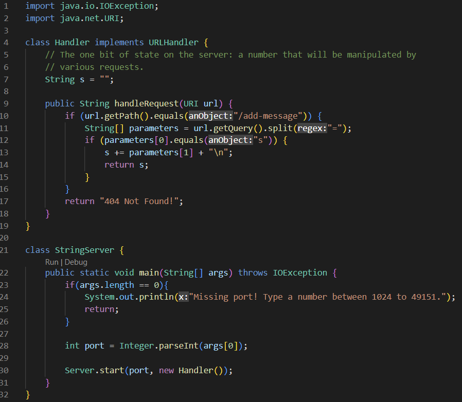
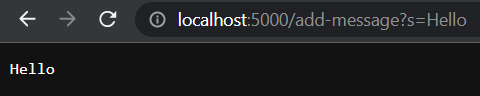
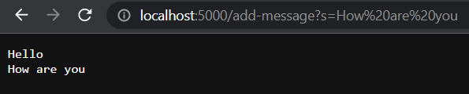

# Lab Report 2
### **Part 1**
**StringServer Code:** \


**Screenshot 1:** \


1. Which methods in your code are called? \
The method that is called is *handleRequest()*.
2. What are the relevant arguments to those methods, and the values of any relevant fields of the class? \
The relative arguments to *handleRequest()* is the parameter *URI url*, the port number, and the string message.
3. How do the values of any relevant fields of the class change from this specific request? If no values got changed, explain why. \
The values that could change are the Strings, URI. The strings can change if you decide to write a different message. The URI changes when you add a different message to the URL which changes the output message on the screen.

**Screenshot 2:** \

1. Which methods in your code are called? \
The method that is called is *handleRequest()*.
2. What are the relevant arguments to those methods, and the values of any relevant fields of the class? \
The relative arguments to *handleRequest()* is the parameter *URI url*, the port number, and the string message.
3. How do the values of any relevant fields of the class change from this specific request? If no values got changed, explain why. \
The values that changed is the String from *"Hello"* to *"How are you"* and the URL after the = sign. 

### **Part 2**
A failure-inducing input for the buggy program: 
````
  @Test
  public void testReversed() {
    int[] input1 = {1, 2, 3, 4};
    assertArrayEquals(new int[]{3, 2, 1}, ArrayExamples.reversed(input1));
  }
}
````
An input that doesn’t induce a failure: 
````
  @Test
  public void testReversed() {
    int[] input1 = {1, 2, 3, 4};
    assertArrayEquals(new int[]{4, 3, 2, 1}, ArrayExamples.reversed(input1));
  }
}
````
The symptom, as the output of running the tests: 
1. Failure:

The symptom was that it was expecting a <3> but was a <4> instead. There's a pattern in the symptom where the length was 3, but actual length was 4 with the array lengths and assertion error. 
3. Doesn't induce a failure: 


The bug before:
````
  static int[] reversed(int[] arr) {
    int[] newArray = new int[arr.length];
    for(int i = 0; i < arr.length; i += 1) {
      arr[i] = newArray[arr.length - i - 1];
    }
    return arr;
  }

````
The bug after:
````
  static int[] reversed(int[] arr) {
    int[] newArray = new int[arr.length];
    for(int i = 0; i < arr.length; i += 1) {
      newArray[i] = arr[arr.length - i - 1];
    }
    return newArray;
  }
````
Problem: 
The problem was that the code wasn't returning the *new* array correctly because it was using arr to try to create a new array instead of using newArray that was mentioned before the for loop, to reverse the elements in the array. You need to create a new array in order to save the changes made and so that it doesn't return the original array. To fix the issue, you swap the arr[i] to newArray[i] in the body of the for loop and return newArray.

### **Part 3**
Q: In a couple of sentences, describe something you learned from lab in week 2 or 3 that you didn’t know before. \
A: Something I learned from lab in week 2 is how to open ports and fork repositories. I also learned about web servers and how to build and run a server on my local computer. Additionally, I was able to use GitHub Desktop and learn about 
```
"push origin" 
```
to make the changes visible in GitHub. 
