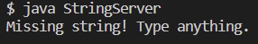

# Lab Report 2 - Servers and Bugs (Week 3)
### **Part 1**
Write a web server called StringServer 

Screenshot: \


1. Which methods in your code are called? \
The method StringServer is called.
2. What are the relevant arguments to those methods, and the values of any relevant fields of the class? \
The relative arguments are Strings and the StringHandler.
3. How do the values of any relevant fields of the class change from this specific request? If no values got changed, explain why. \
The value doesn't change because if you don't type any value, the output will be the same, nothing. 

### **Part 2**
A failure-inducing input for the buggy program: 
````
  @Test
  public void testReversed() {
    int[] input1 = {1, 2, 3, 4};
    assertArrayEquals(new int[]{3, 2, 1}, ArrayExamples.reversed(input1));
  }
}
````
An input that doesn’t induce a failure: 
````
  @Test
  public void testReversed() {
    int[] input1 = {1, 2, 3, 4};
    assertArrayEquals(new int[]{4, 3, 2, 1}, ArrayExamples.reversed(input1));
  }
}
````
The symptom, as the output of running the tests: 
1. Failure:

3. Doesn't induce a failure: 


The bug before:
````
  static int[] reversed(int[] arr) {
    int[] newArray = new int[arr.length];
    for(int i = 0; i < arr.length; i += 1) {
      arr[i] = newArray[arr.length - i - 1];
    }
    return arr;
  }

````
The bug after:
````
  static int[] reversed(int[] arr) {
    int[] newArray = new int[arr.length];
    for(int i = 0; i < arr.length; i += 1) {
      newArray[i] = arr[arr.length - i - 1];
    }
    return newArray;
  }
````
Problem: 
The problem was that the code wasn't returning the *new* array correctly with the elements of the input array reversed. To fix the issue, you swap the arr[i] and newArray[i] in the body of the for loop and return newArray.

### **Part 3**
Q: In a couple of sentences, describe something you learned from lab in week 2 or 3 that you didn’t know before. \
A: Something I learned from lab in week 2 is how to open ports and fork repositories. I also learned about web servers and how to build and run a server on my local computer. Additionally, I was able to use GitHub Desktop and learn about "push origin" to make the changes visible in GitHub. 
